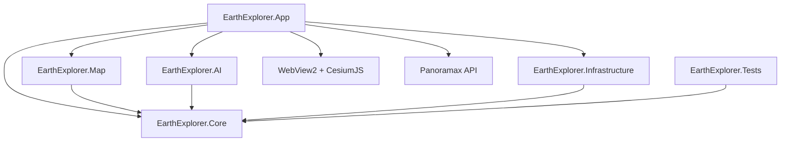

# Архитектура ExploreEarth

## Зафиксированный стек

| Область | Выбор | Почему |
|---|---|---|
| Платформа | C# 14, .NET 10, Windows 10/11 x64 | Нативная сборка `.exe`, хорошая поддержка асинхронности и DI |
| Интерфейс | WPF + MVVM | Нативный Windows UI, зрелая привязка данных и аппаратно ускоренный рендеринг |
| 2D-карта | Mapsui 5.1.0 WPF | Нативный WPF-контрол, метки и геометрии без браузера |
| 3D Земля | CesiumJS в Microsoft WebView2 | Глобус, атмосфера, освещение и плавная камера без отдельного локального сервера |
| Карты | OpenStreetMap raster tiles | Открытые данные; в 2D и 3D интерфейсе постоянно показывается атрибуция |
| Уличные изображения | Федерация Panoramax | Открытая альтернатива закрытым Street View API; покрытие формируется участниками |
| Геокодирование | Nominatim через абстракцию `IGeocodingService` | Не требует ключа для разработки; запросы ограничены и кэшируются |
| EXIF | MetadataExtractor 2.9.3 | Полностью локальное чтение GPS, даты, камеры, высоты и направления |
| OCR | TesseractOCR 5.5.2 + `tessdata_fast` eng/rus | Локальный CPU-запуск без Python и без расхода VRAM |
| Визуальная модель | CLIP/SigLIP в ONNX + база ориентиров (следующий этап) | Локальная классификация признаков без обещания точного адреса |
| Хранение | SQLite (следующий этап) | История, метки и результаты без отдельного сервера |
| Секреты | Windows Credential Manager (следующий этап) | API-ключи не попадут в конфиг и Git |

## Ограничения поставщиков

- Публичный сервер Nominatim используется только для явного поиска. Для массового использования нужен собственный Nominatim либо коммерческий провайдер.
- Публичные тайлы OpenStreetMap нельзя скачивать пачками или превращать в офлайн-базу. Атрибуция не скрывается элементами интерфейса.
- Топографический слой использует `tile.openmaps.fr` только для обычного интерактивного просмотра с атрибуцией; предзагрузка отсутствует.
- Panoramax получает небольшой bounding box вокруг выбранной точки. Приложение не выполняет массовое сканирование покрытия и не загружает панорамы заранее.
- Лицензия и авторство конкретной фотографии Panoramax определяются метаданными соответствующего инстанса и снимка.
- Спутниковый слой и фотограмметрические 3D-здания не включены, пока не выбран поставщик с подходящей лицензией и ключом.

## Зависимости проектов

`Core` не зависит от WPF, Mapsui, HTTP или конкретной ML-библиотеки. Внешние компоненты подключаются через интерфейсы или сервисы уровня `App`, поэтому карту, геокодер или AI backend можно заменить без переписывания бизнес-логики.

## Поток поиска

1. Строка сначала проверяется локальным `CoordinateParser`.
2. Валидные координаты сразу отображаются на карте без сетевого запроса.
3. Обычный текст передаётся в `IGeocodingService`.
4. Nominatim-клиент соблюдает тайм-аут, интервал и локальный кэш.
5. Выбранный результат передаётся в `IMapNavigationService`, проецируется в EPSG:3857 и отмечается точкой.

## Поток уличного просмотра

1. Пользователь перетаскивает человечка на 2D-карту.
2. Экранная позиция преобразуется Mapsui из координат viewport в EPSG:3857, затем в WGS84.
3. `PanoramaxService` последовательно проверяет небольшие радиусы вокруг точки на нескольких федеративных инстансах.
4. Выбирается ближайший снимок по расстоянию, без фонового сканирования больших областей.
5. Превью отображается в WPF, а интерактивная панорама открывается во втором WebView2.

## Поток GeoGuessr

1. Выбирается случайный раунд с эталонной координатой.
2. Panoramax ищет ближайшее доступное уличное изображение.
3. Пользователь изучает снимок и ставит метку на 2D-карте.
4. После подтверждения рассчитываются расстояние и счёт до 5000 очков.
5. Карта показывает выбранную и правильную точки.

## Поток фотографии

1. Файл проверяется по расширению и лимиту 80 МБ.
2. EXIF читается локально; GPS сразу становится гипотезой с высокой уверенностью.
3. При отсутствии GPS Tesseract локально распознаёт русский и английский текст.
4. До пяти наиболее похожих на географические строки последовательно проверяются через Nominatim.
5. Пользователь получает не больше трёх ориентировочных гипотез с доказательством, уверенностью и радиусом.

Оригинал не изменяется и не отправляется в сеть. Сетевой сервис получает только распознанные текстовые строки. Tesseract создаётся на время одного анализа, после чего освобождает ресурсы.

## Поставка версии 1.0

- Приложение публикуется self-contained для `win-x64`.
- CI проверяет версию `ExploreEarth.exe`, обязательные документы, локальную страницу 3D Земли и наличие `WebView2Loader.dll`.
- OCR-модели `eng` и `rus` проверяются по минимальному размеру.
- Установщик Inno Setup при необходимости ставит WebView2 Evergreen Runtime и Microsoft Visual C++ Runtime.
- Portable ZIP включает установщики зависимостей и `Install-Prerequisites.cmd`.

## План управления моделями

Модели будут храниться в `%LOCALAPPDATA%\EarthExplorer\Models`. Для RTX 3070 профиль `Balanced` будет ограничиваться примерно 6,4 ГБ VRAM, а бездействующая модель — выгружаться. При закрытии приложения все рабочие процессы должны завершаться вместе с главным процессом.

## Лицензии

- WPF/.NET — MIT.
- Mapsui — MIT.
- CesiumJS — Apache-2.0.
- MetadataExtractor — Apache-2.0.
- OpenStreetMap data — ODbL; атрибуция обязательна.
- TesseractOCR и модели `tessdata_fast` — Apache-2.0.
- WebView2 SDK и Runtime — применимые условия Microsoft.
- Panoramax — лицензии программных компонентов и отдельных фотографий определяются соответствующими проектами и инстансами.
- Конкретные CV-модели будут добавлены только после проверки лицензии весов, а не только исходного кода.
