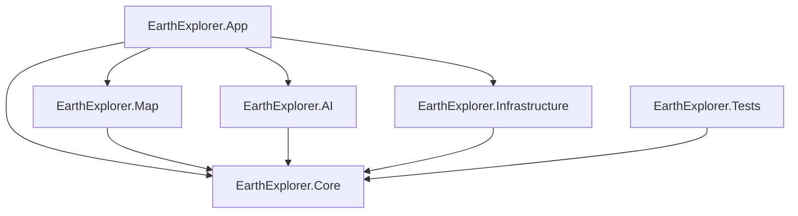

# Архитектура ExploreEarth

## Зафиксированный стек

| Область | Выбор | Почему |
|---|---|---|
| Платформа | C# 14, .NET 10, Windows 10/11 x64 | Актуальная LTS-платформа, нативная сборка `.exe`, хорошая поддержка асинхронности и DI |
| Интерфейс | WPF + MVVM | Нативный Windows UI без браузера, зрелая привязка данных, аппаратно ускоренный рендеринг |
| Карта | Mapsui 5.1.0 WPF | Нативный WPF-контрол, OpenStreetMap/MBTiles, метки и геометрии без WebView2 |
| Карты | OpenStreetMap raster tiles | Открытые данные; в интерфейсе всегда показывается атрибуция |
| Геокодирование | Nominatim через абстракцию `IGeocodingService` | Не требует ключа для разработки; запросы ограничены 1 запросом/сек и кэшируются |
| EXIF | MetadataExtractor 2.9.3 | Полностью локальное чтение GPS, даты, камеры, высоты и направления |
| OCR | ONNX Runtime + PaddleOCR-модели (этап 4) | Локальный запуск без Python, CUDA/DirectML/CPU |
| Визуальная модель | CLIP/SigLIP в ONNX + база ориентиров (этап 4) | Реалистичная локальная классификация признаков, но без обещания точного адреса |
| Хранение | SQLite (этап 5) | История, метки и результаты без отдельного сервера |
| Секреты | Windows Credential Manager (этап 5) | API-ключи не попадут в конфиг и Git |

## Ограничения поставщиков

- Публичный сервер Nominatim используется только для явного поиска после нажатия кнопки. Автодополнение по каждой букве на нём запрещено политикой сервиса.
- Для массового использования нужен собственный Nominatim либо коммерческий провайдер, выбранный в настройках.
- Публичные тайлы OpenStreetMap нельзя скачивать пачками или превращать в офлайн-базу. Для офлайн-режима будет использоваться легально полученный MBTiles-файл.
- Спутниковый слой не включён, пока не выбран поставщик с лицензией и ключом.

## Зависимости проектов

`Core` не зависит от WPF, Mapsui, HTTP или конкретной ML-библиотеки. Внешние компоненты подключаются через интерфейсы. Это позволяет заменить Nominatim, карту или AI backend без переписывания бизнес-логики.

## Поток поиска

1. Строка сначала проверяется локальным `CoordinateParser`.
2. Валидные координаты сразу отображаются на карте без сетевого запроса.
3. Обычный текст передаётся в `IGeocodingService`.
4. Nominatim-клиент соблюдает тайм-аут, интервал и локальный кэш.
5. Выбранный результат передаётся в `IMapNavigationService`, проецируется в EPSG:3857 и отмечается точкой.

## Поток фотографии

Сейчас реализован безопасный первый шаг: проверка расширения и размера, локальное чтение EXIF и немедленное отображение GPS. Оригинал не изменяется и не отправляется в сеть. OCR, объединение нескольких фотографий и визуальные гипотезы добавляются отдельным модулем, чтобы их можно было загружать в VRAM только по запросу.

## План управления моделями

Модели будут храниться в `%LOCALAPPDATA%\EarthExplorer\Models`. `IModelManager` получит состояния `NotInstalled`, `Downloading`, `Installed`, `Loading`, `Ready`, `Processing`, `Unloading`, `Corrupted` и `Error`. Для RTX 3070 профиль `Balanced` ограничивается примерно 6,4 ГБ VRAM, а бездействующая модель выгружается через 3 минуты. При закрытии приложения все рабочие процессы привязываются к Windows Job Object и завершаются вместе с главным процессом.

## Лицензии

- WPF/.NET — MIT.
- Mapsui — MIT.
- MetadataExtractor — Apache-2.0.
- OpenStreetMap data — ODbL; атрибуция обязательна.
- Конкретные OCR/CV-модели будут добавлены только после проверки лицензии весов, а не только исходного кода.
